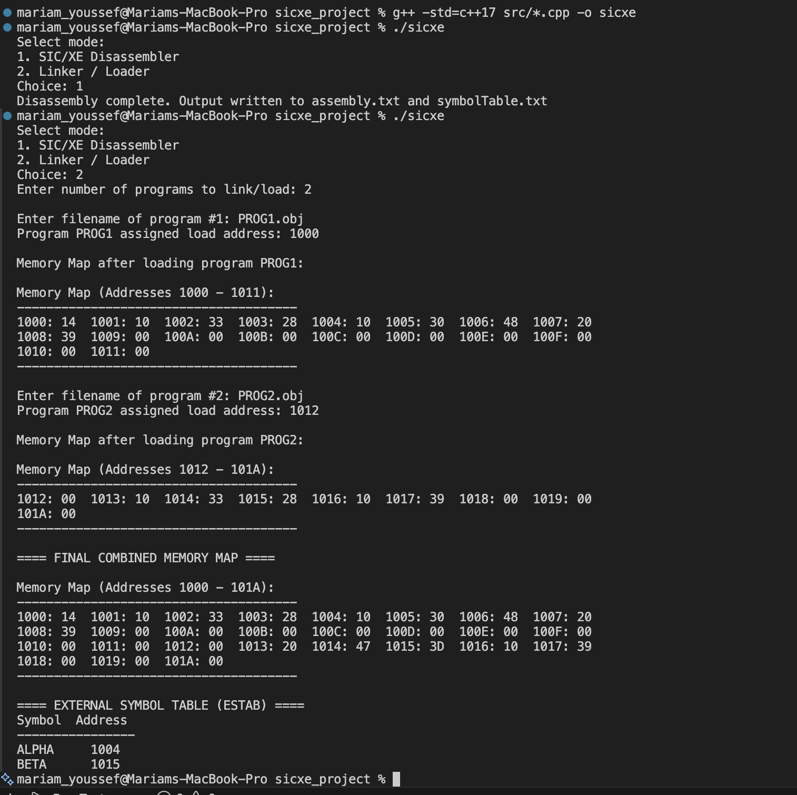

# SIC/XE Disassembler and Linking Loader  (C++)

## Overview

This project implements a two-pass linking loader and disassembler for the SIC/XE architecture in C++.

It supports external symbol resolution (EXTDEF / EXTREF), relocation using modification records, and disassembly of object code formats 1–4.

The project simulates memory loading, builds an external symbol table (ESTAB), and performs proper relocation at the half-byte (nibble) level as required by the SIC/XE specification.

## Features

- SIC/XE instruction formats 1–4
- PC-relative and Base-relative addressing
- Disassembler with symbol resolution
- Two-pass linking loader
- External symbol table (ESTAB) construction
- Support for EXTDEF and EXTREF
- Relocation using Modification (M) records
- Nibble-level field relocation handling
- Memory map visualization

## Architecture

The system is divided into modular components to separate responsibilities and improve maintainability,simulating the main functions of a real-world disassembler and linking loader.

---
### Disassembler

#### Pass 1 – Analysis and Symbol Detection
- Scans object code to determine instruction boundaries
- Identifies instruction formats (1–4)
- Detects data regions (BYTE and WORD)
- Builds a symbol table for label reconstruction
- Determines addressing modes (immediate, indirect, indexed, PC-relative, base-relative)

#### Pass 2 – Assembly Reconstruction
- Converts object code into readable assembly
- Resolves symbolic operands where possible
- Outputs formatted assembly listing in assembly.txt
- Generates a reconstructed symbol table in symbolTable.txt

---
### Linking Loader

#### Pass 1 – Symbol Resolution
- Reads all object files (H,D,R,T,M,E records)
- Assigns load addresses to each control section
- Builds the global External Symbol Table (ESTAB)
- Resolves EXTDEF definitions
- Prepares relocation data for Pass 2

#### Pass 2 – Relocation and Loading
- Loads T (Text) records into simulated memory
- Applies all M (Modification) records
- Performs relocation at the half-byte (nibble) level
- Uses ESTAB to resolve EXTREF symbols
- Produces the final combined memory map

---


### Shared Components

- Utility functions for parsing and formatting
- Hex conversion utilities

## Project Structure
```
sicxe_project/
├── src/
│   ├── main.cpp
│   ├── disassembler.cpp
│   ├── loader.cpp
│   ├── utils.cpp
│   ├── disassembler.h
│   ├── loader.h
│   └── utils.h
├── examples/
│   ├── PROG1.obj
│   ├── PROG2.obj
│   ├── in.txt
│   ├── assembly.txt
│   └── symbolTable.txt
├── docs/
│   └── screenshot.png
├── README.md
└── LICENSE
```

## Build Instructions

Compile using:

```bash
g++ -std=c++17 src/*.cpp -o sicxe
```
Then run:
```
./sicxe
```
## Sample Output
  

## What I Learned

- Implementation of a two-pass disassembler and linking loader
- Construction and use of an external symbol table (ESTAB)
- Handling relocation at the half-byte level
- Bit-level masking and field extraction
- Differences between absolute and relocatable object code
- Modular C++ project architecture

## Limitations

- Current data detection focuses on numeric BYTE and WORD patterns; character literal reconstruction is limited.
- The loader assumes well-formed object files and does not perform extensive validation of malformed records.
- The project focuses on core SIC/XE features and does not implement floating-point instruction simulation.

## Future Improvements

- Enhance BYTE directive detection to fully reconstruct character literals (e.g., C'EOF').
- Add robust validation for malformed object records.
- Support additional SIC/XE instruction extensions.
- Implement command-line argument support for flexible input paths.
- Add automated unit tests for relocation and modification record handling.
- Improve memory allocation strategy for multiple control sections.